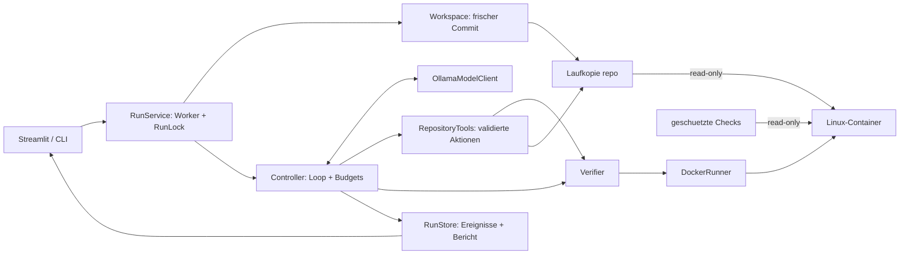
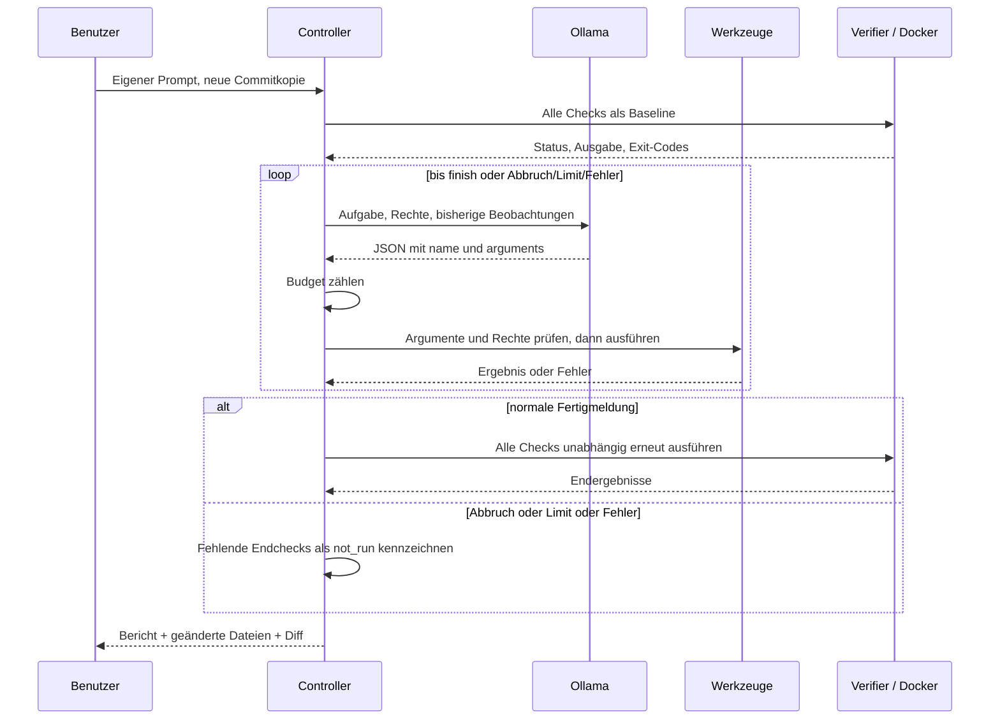

# Coding Harness zum Lernen

Ein eigener Python-Controller verbindet Ollama mit begrenzten Dateiwerkzeugen und
Docker-Checks. Du gibst eine Coding-Aufgabe ein; das Modell untersucht und verändert
eine frische Repositorykopie. Der Harness kontrolliert Rechte, Budgets und Ergebnisse
und zeigt Fortschritt, geänderte Dateien, Diff und Prüfergebnisse in UI oder CLI.
Es gibt kein fertiges Agentenprodukt und keinen eingebauten Reparaturplan.

Maßgebliche Spezifikation: [Stage-1-Aufgabe](docs/assignment/stage-1-coding-harness.pdf).
Diese README enthält Einrichtung, Bedienung, Klassen, Architektur und Diagramme.

## Einrichtung und Start

### Auf einem anderen Windows-PC

1. Installiere [Python 3.12](https://www.python.org/downloads/windows/) mit
   Python-Launcher und PATH-Eintrag sowie [Git](https://git-scm.com/download/win).
   Python führt den Harness aus; Git lädt das Projekt und den fixierten Zielcommit.
2. Installiere und starte [Docker Desktop](https://www.docker.com/products/docker-desktop/).
   Verwende die Linux-Engine. Falls das Setup WSL 2 oder einen Neustart verlangt,
   erledige dies zuerst. Docker isoliert den Zielcode und seine Tests vom Host.
3. Installiere [Ollama für Windows](https://ollama.com/download/windows).
   Ollama führt das Modell lokal aus und stellt die API unter `127.0.0.1:11434`
   bereit. Öffne danach eine neue PowerShell, damit die PATH-Einträge verfügbar sind.

Lade das Modell einmal herunter (etwa 4,7 GB; zusätzliche Installation und Laufzeitspeicher nötig):

```powershell
ollama pull qwen2.5-coder:7b
```

Ollama läuft nach der Installation normalerweise im Hintergrund. Ist die API nicht
erreichbar, starte Ollama über das Startmenü. Ohne laufenden Server kann der Harness
keine Modellanfragen senden. Ein API-Key ist nicht erforderlich.

Lade dann das Projekt und wechsle in seinen Ordner:

```powershell
git clone https://github.com/MichaelReichenberger/coding-harness.git
cd coding-harness
```

Erzeuge eine eigene Python-Umgebung und installiere die festgelegten Paketversionen:

```powershell
py -3 -m venv .venv
.\.venv\Scripts\python.exe -m pip install -r requirements.lock
```

`py -3` muss Python 3.12 auswählen; mit `py -3 --version` prüfen. `.venv` trennt
die Projektpakete von anderen Python-Projekten. `requirements.lock` enthält unter
anderem Streamlit für die Oberfläche und die Pakete für Modellkommunikation und Tests.
Eine Aktivierung der Umgebung ist nicht nötig: Alle Befehle verwenden ihren Interpreter direkt.

Bereite das Zielrepository und die isolierte Prüfumgebung vor:

```powershell
.\.venv\Scripts\python.exe -m harness setup --build
.\.venv\Scripts\python.exe -m harness doctor
```

`setup --build` lädt den festgelegten Supermarket-Commit und baut das Docker-Image.
`doctor` prüft Pakete, Git, Linux-Engine, Image, Zielcommit und installiertes Modell.
Erst bei `live_ready: true` ist ein echter Modelllauf startbereit. Das Harness lädt
selbst keine Modelle herunter. Für die erstmalige Einrichtung ist Internet erforderlich;
die Modellanfragen und Container-Checks laufen anschließend lokal.

Starte die Oberfläche und lasse das PowerShell-Fenster geöffnet:

```powershell
.\.venv\Scripts\python.exe -m streamlit run app.py --server.address 127.0.0.1
```

UI: http://127.0.0.1:8501/.

1. In der Seitenleiste `qwen2.5-coder:7b` als Ollama-Modell verwenden.
2. „Umgebung prüfen“, eigenen Bugfix-Prompt schreiben, „Lauf starten“.
3. Werkzeugaufrufe, Zähler und Checks verfolgen; bei Bedarf „Abbrechen“.
4. Diff und Bericht prüfen/herunterladen. Ein neuer Lauf beginnt beim selben Commit.

Mit `Ctrl+C` im Serverfenster beendest du die Oberfläche. Für spätere Starts reichen
laufendes Docker Desktop, Ollama und der Streamlit-Befehl im Projektordner.

Linux: mit `python3.12 -m venv .venv` beginnen und in allen weiteren Befehlen
`.venv/bin/python` statt `.\.venv\Scripts\python.exe` verwenden. Die Windows-Anleitung
ist der hier praktisch geprüfte Weg.

Optional `config.example.toml` nach `config.local.toml` kopieren. Für CLI/Standardmodell
`HARNESS_MODEL`, für den Server `HARNESS_OLLAMA_BASE_URL` setzen. Beispiel:

```powershell
$env:HARNESS_MODEL = 'NAME-DEINES-INSTALLIERTEN-MODELLS'
.\.venv\Scripts\python.exe -m harness run --task 'Dein Bugfix-Auftrag'
```

## Zielrepository und Bugfix

Der Python-Teil der öffentlichen
[Supermarket Receipt Kata](https://github.com/emilybache/SupermarketReceipt-Refactoring-Kata)
läuft vom Commit `c72d68abd77a417f84193b72a3b8d14177336066`.
`Teller` verarbeitet einen `ShoppingCart` und erzeugt einen `Receipt`, den
`ReceiptPrinter` druckt. Damit prüft die kleine Aufgabe Verhalten über mehrere Module
mit echten Preis- und Rabattregeln und vorhandenen Upstream-Tests.

Der Ausgangscode zeigt Stückmengen als `3.0` statt `3` an. Die geschützte Akzeptanz
prüft Stückmengen 2, 3 und 5 sowie leere, einzelne und gewogene Einkäufe als Kontrollen.
Gewichte behalten drei Nachkommastellen, Geldbeträge zwei; gespeicherte Mengen und
Preisregeln bleiben unverändert. Details: [Task und Akzeptanz](docs/task.md).

Die sechs editierbaren Anwendungsdateien stehen in `config/target.json`. Geschützte
Tests liegen außerhalb der Laufkopie in `checks/`. Die Referenz wird nie repariert;
jeder Lauf startet wieder mit dem ursprünglichen Fehler.

### Beispielprompt

Dieser Nutzerprompt wurde mit dem echten Modell erfolgreich geprüft. Er wird nicht
automatisch eingefügt und enthält keinen Patch. Die Dateiangabe und die präzisierte
Verhaltensbeschreibung zählen als offengelegte manuelle Hilfe.

```text
Fix the receipt quantity display for products sold by EACH. A quantity of 3.0 must appear as 3 on the printed receipt; 2.0 as 2; 5.0 as 5. Quantities of KILO products must still appear with three decimal places, for example 1.500. All monetary prices must still have two decimal places, for example 1.25. Keep stored quantities and pricing unchanged. First read the entire receipt_printer.py. Distinguish the quantity formatter from the price formatter, and change only the EACH quantity formatting. Use the exact source text you read for replace_text. Then run acceptance, regression_core and regression_pricing. If all pass, finish; if a check fails, reread the code before another edit.
```

**Grüne Checks bestätigen die konfigurierte Aufgabe, nicht jeden beliebigen Prompt.**
Für eine andere Aufgabe müssen zuvor passende geschützte Akzeptanztests erstellt und
auf dem Ausgangscode als fachlich rot nachgewiesen werden. Das Vorgehen steht in
[docs/task.md](docs/task.md). Andere, hier nicht geprüfte Fehler können im Zielrepo bestehen bleiben.

## Klassen und Verantwortlichkeiten

Das Modell schlägt eine Aktion vor, besitzt aber selbst weder Datei- noch Shellzugriff.
Der Python-Harness prüft und führt den Vorschlag aus und liefert das Ergebnis oder
einen Fehler zurück. Rechte werden in Anwendungscode durchgesetzt.

| Datei | Klassen/Funktionen | Verantwortung |
|---|---|---|
| `app.py` | `get_service`, `main`, `monitor` | Leeres Aufgabenfeld, Modellauswahl, Start/Abbruch, Verlauf, Diff und Checks. Keine Werkzeugausführung. |
| `harness/__main__.py` | `main` | CLI-Befehle `setup`, `doctor`, `baseline`, `run --task`. |
| `harness/controller.py` | `Controller` | Reihenfolge des Laufs, Modellgespräch, Zähler, Abbruchgründe und Endbericht. |
| `harness/models.py` | `OllamaModelClient` | Sendet Nachrichten/JSON-Schema per HTTP und liefert genau eine Aktion. |
| `harness/models.py` | `ScriptedModelClient`, `tool_reply` | Nur Tests: vorgegebene Antworten/Fehler ohne LLM. Kein UI-/CLI-Modus und kein eingebauter Reparaturplan. |
| `harness/repository.py` | `RepositoryTools` | Auflisten, Lesen, Suchen, eindeutiges Ersetzen, Checkaufruf und Fertigmeldung. |
| `harness/repository.py` | `ListArgs`, `ReadArgs`, `SearchArgs`, `EditArgs`, `CheckArgs`, `FinishArgs` | Kleine Datenschemata der sechs Werkzeuge. Keine Geschäftslogik; lehnen falsche Typen/Zusatzfelder ab. |
| `harness/repository.py` | `REGISTRY`, `validate_call`, `tool_schemas` | Eine erlaubte Werkzeugliste dient sowohl Modellbeschreibung als auch tatsächlicher Validierung. |
| `harness/sandbox.py` | `DockerRunner`, `CheckResult`, `CHECKS` | Feste Testbefehle in eingeschränkten Containern ausführen, strukturierten Befund sammeln und Cleanup bestätigen. |
| `harness/process.py` | `capture`, `BoundedOutput`, `ProcessResult` | Vertrauenswürdige Git-/Docker-CLI-Prozesse starten, Ausgabe schon beim Lesen begrenzen. Keine Sandbox für Python-Zielcode. |
| `harness/verifier.py` | `Verifier`, `all_passed` | Baseline, angeforderte Checks und Endsuite protokollieren; nur reale vollständige Erfolge akzeptieren. |
| `harness/verifier.py` | `acceptance_evidence`, `baseline_reproduces` | Den fachlichen Rot-Nachweis des gewählten Belegdruck-Tests im Bericht bestätigen. |
| `harness/workspace.py` | `Workspace` | Frische Commitkopie `repo`, Vergleichskopie `base`, eindeutige Lauf-ID und Diff. |
| `harness/workspace.py` | `RunLock` | Betriebssystem-Sperre gegen parallele CLI-/UI-Läufe. |
| `harness/workspace.py` | `prepare_reference`, `export_commit`, `tree_hashes`, Git-Helfer | URL/Commit prüfen, sicher exportieren und Dateiintegrität vergleichen. |
| `harness/service.py` | `RunService` | Genau einen Worker starten; Zustand an UI liefern und Abbruchsignal setzen. |
| `harness/store.py` | `RunStore`, `clip` | Begrenzte Ereignisdatei, thread-sichere UI-Snapshots und atomarer JSON-Bericht. |
| `harness/config.py` | `StrictModel`, `Limits`, `Settings`, `Target`, Ladefunktionen | Einstellungen und erlaubten Zielbereich streng validieren. Keine Aufgabe/keine Reparatur hinterlegt. |
| `harness/doctor.py` | `doctor` | Tatsächliche Erreichbarkeit von Docker und Ollama sowie Git, Commit, Pakete und Image prüfen. |
| `harness/errors.py` | `HarnessError` und fünf Unterklassen | Fehler unterscheiden: Tool, Sandbox, Modell, Abbruch, Limit. Keine zusätzliche Verarbeitungsschicht. |
| `harness/__init__.py` | keine | Kennzeichnet das Python-Paket; importiert keinen Zielcode. |
| `checks/entry.py` | `main` | Geschützter Testadapter innerhalb von Docker; lädt Zielcode und geschützte Tests. |
| `checks/scenario.py` | `checkout` | Frische synthetische Produkte/Preise anlegen und echte Kasse/Warenkorb/Beleg verbinden. |
| `checks/acceptance.py` | `main` | Sechs Belegdruckfälle mit Stückzahlen, Gewichten, Kontrollen, Befund und Exit-Code. |
| `checks/pricing_regression.py` | `PricingRegression` | Fünf weitere Preisregeln vor Nebenwirkungen schützen. |
| `checks/upstream/tests/*.py` | ursprünglicher `FakeCatalog`, `SupermarketTest`, Paketdatei | Unveränderte Testkopie aus dem öffentlichen Ausgangscommit. Absichtlich nicht umkommentiert; Herkunft/Hashes/Lizenz daneben. |

## Architektur und Ablauf

Die Oberfläche und die CLI verwenden denselben `RunService` und `Controller`.
Ein Worker-Thread führt den langsamen Lauf aus; Streamlit liest regelmäßig Snapshots.
Ein Mutex verhindert Doppelstarts im Prozess. `RunLock` verhindert parallele UI-/CLI-Läufe.
Eine gemeinsame `gate`-Sperre verhindert Dateiänderungen während eines Checks und seines Cleanup.
Ein Abbruch setzt ein `threading.Event`, das vor Aktionen und nach Modellantworten geprüft wird.





## Modellprotokoll

Ein JSON-Objekt pro Runde: `{"name": "...", "arguments": {...}}`.
Ollama bekommt ein aus der Werkzeugregistry abgeleitetes Schema. Der Controller
speichert die Aktion als Assistant-Nachricht und das begrenzte Ergebnis als benannte
User-Beobachtung. Es handelt sich um strukturierte JSON-Ausgaben, nicht um native
Ollama-Toolcall-Nachrichten. Anwendungscode prüft alle Rechte erneut.

Das Modell erhält keinen vorbereiteten Dateiausschnitt und keine Reparaturvorgabe.
Die Beobachtungen stammen nur aus seinen eigenen Werkzeuganfragen. Ein HTTP-Aufruf
ist abbrechbar und zeit-/größenbegrenzt. `ScriptedModelClient` wird ausschließlich in
Tests verwendet. Es gibt keine Laufzeit-Alternative, die einen festen Patch einspielt.

## Datei- und Ausführungsgrenze

- Nur eine frische Kopie des fixierten Git-Commits ist editierbar. Die sechs freigegebenen
  Dateien stehen in `config/target.json`; Tests und Harness-Konfiguration bleiben geschützt.
- Aufgelöste Pfade müssen im Repository liegen. Absolute Pfade, Traversal, Symlinks,
  Windows-Junctions, Hardlinks, ADS und geschützte Namen werden zurückgewiesen.
- `replace_text` ersetzt genau eine eindeutige Stelle atomar. Kein freies `eval`, keine
  Agentenshell, keine Werkzeuge für Push, Merge, Installation oder Deployment.
- Zielcode läuft ausschließlich in Linux-Docker-Containern. `/repo` und `/trusted`
  sind read-only; nur `/tmp` ist beschreibbar (64 MiB tmpfs).
- Nicht-root UID 10001, read-only Rootdateisystem, kein Netzwerk/Docker-Socket,
  keine Credentials/Hostumgebung, keine Capabilities, `no-new-privileges`.
- 64 Prozesse, 512 MiB RAM ohne zusätzlichen Swap, eine CPU. Docker-Logging ist
  ausgeschaltet; der Harness liest Ausgaben begrenzt und entleert die Pipes weiter.
- Ein gemeinsamer Lock verhindert Edits während Checks einschließlich Cleanup.
- Nach jedem Check den eigenen Container stoppen/entfernen und Abwesenheit prüfen.
  Unbestätigtes Ende blockiert weitere Aktionen und neue Läufe (`active-container.json`).

## Prüfergebnisse

Alle Läufe verwenden `acceptance`, `regression_core`, `regression_pricing` vor und
nach der Änderung. Fachlich rote Baselinechecks sind erlaubt und bleiben sichtbar.
Nicht verfügbare Checks oder Baseline-Timeouts blockieren die Modellphase.
`finish` fordert die Endprüfung an. Nur `passed` mit Exit-Code 0, ohne Timeout/Abbruch
und mit bestätigtem Cleanup für **alle** Checks führt zum Zustand `passed`.

`success` im Bericht heißt „alle konfigurierten Endchecks bestanden“. Es ist kein
allgemeines Urteil über die vollständige Erfüllung eines beliebigen Nutzerprompts.
`baseline_bug_reproduced` beschreibt separat den vorbereiteten Belegdruck-Nachweis.
Die Akzeptanz und die Regressionen bleiben für den Agenten schreibgeschützt.

## Standardbudgets

| Grenze | Standard | Bedeutung |
|---|---:|---|
| Aktionen | 40 | Toolversuche einschließlich Ablehnungen, zusätzlich Modellwiederholungen |
| Runden | 50 | Höchstens so viele Modellfortsetzungen |
| Wiederholungen | 2 je Anfrage | Danach model_error; jede Wiederholung kostet Aktionsbudget |
| Check | 120 s | Danach Container beenden; begrenztes Cleanup kommt zeitlich hinzu |
| Modellanfrage | 180 s | Gesamtdauer einer HTTP-Anfrage, pro Wiederholung erneut |
| stdout + stderr / Werkzeugbeobachtung | 64 KiB | Schon beim Einlesen begrenzt, Kürzung sichtbar |
| Datei / Modellantwort | jeweils 256 KiB | Größere Eingaben zurückweisen |
| Gesprächskontext | 192 KiB | Sicherer Stopp; Toolbeschreibungen kommen als fester Zusatz hinzu |
| Artefakte | 8 MiB je Lauf | Hälfte Ereignisse, Viertel Bericht, Viertel Diff |
| Auflisten / Suchen / Lesen | 200 Dateien / 50 Treffer / 400 Zeilen | Zusätzliche Werkzeuggrenzen |
| Git-Archiv | 20 MiB komprimiert / 40 MiB entpackt | Begrenzt Repositoryimport |

Die Quellkopien zählen separat. Es gibt kein globales Limit für die Anzahl archivierter
Läufe; abgeschlossene `.harness/runs/`-Ordner können nach Sicherung entfernt werden.
`config.local.toml` und Umgebungsvariablen konfigurieren den Harness, niemals der Agent.

## Grenzen des POC

Ein lokaler Benutzer, ein aktiver Lauf, festes kleines Repository, keine Dateierstellung
oder -löschung. Ein Container teilt den Kernel des Docker-Hosts; kein VM-Schutzversprechen.
Testdateien sind geschützt, Zielcode und Tests teilen aber einen Python-Prozess im
Container. Gegen absichtliches Manipulieren des Testinterpreters ist dies kein
unabhängiger Beweis. Deshalb bleibt die Prüfung des Diffs erforderlich.

Identischer Commit, Image-ID, Checkhashes und Scripted-Tests machen den Harness
reproduzierbar. Echte LLM-Antworten und deren Erfolg sind auch bei Temperatur 0 nicht
garantiert reproduzierbar. Das wird getrennt protokolliert.
## Automatisierte Prüfungen und Reproduktion

Im Projektordner mit eingerichteter `.venv`, Docker-Image und Zielreferenz:

```powershell
.\.venv\Scripts\python.exe -m pip check
.\.venv\Scripts\python.exe -m pytest -q
.\.venv\Scripts\python.exe -m pytest -q --docker -m docker
.\.venv\Scripts\python.exe -m harness baseline
.\.venv\Scripts\python.exe -m ruff check harness app.py tests checks/entry.py checks/acceptance.py checks/scenario.py checks/pricing_regression.py
```

Offline-Tests brauchen weder Modellkonto noch API-Key. Fünf Docker-Fälle werden ohne
`--docker` ausdrücklich übersprungen; mit `--docker` ist fehlende Infrastruktur ein Fehler.
`baseline` liefert Exit-Code 0, wenn der vorbereitete fachliche Fehler reproduziert wird
und beide Regressionen bestehen. Ein echter `run` liefert 0 nur nach grünen Endchecks,
sonst 2. `Ctrl+C` fordert bei einem CLI-Lauf einen Abbruch an.

| Datei | Nachweis |
|---|---|
| `tests/conftest.py` | Gemeinsame Testkopie, `FakeRunner` und Factory für den Controller; Docker nur mit expliziter Option. |
| `tests/test_controller.py` | Rückgabe von Ergebnissen/Fehlern, frei eingegebener Prompt, Limits, Abbruch, Fehlstatus und Endchecks. |
| `tests/test_repository.py` | Dateifunktionen, eindeutige Änderungen, falsche Argumente und Pfadausbrüche. |
| `tests/test_models.py` | HTTP-JSON, fehlerhafte/große Antworten, Timeout und Abbruch ohne echten Server. |
| `tests/test_process.py` | Ausgabe-/Prozessgrenzen einschließlich Nonzero-Exit. |
| `tests/test_sandbox_safety.py` | Containerkonfiguration und Fehler/Cleanup anhand kontrollierter Prozessantworten. |
| `tests/test_workspace_store.py` | Lock, Diff, Konfigurationsvalidierung und Artefaktbudget. |
| `tests/test_ui.py` | Leeres Aufgabenfeld, Prompt/Modell weiterreichen, Start ohne Doppelstart, Abbruch und Ergebnisdarstellung. |
| `tests/test_docker.py` | Echte Mount-/Netzgrenze, Nonzero/große Ausgabe, Timeout/Abbruch mit Kindprozess und deterministischer Rot-Grün-Bugfix. |

Der feste Patch in **einem Integrationstest** ist eine Testfixture, kein Laufmodus.
So lässt sich der Harness reproduzierbar prüfen, selbst wenn ein Modell die Aufgabe
nicht löst. Die PDF verlangt daneben einen echten Modelllauf; dieser bleibt unabhängig
vom deterministischen Test und darf nie durch ihn als erledigt gelten.

## Abgabenachweise und Projektstruktur

Der aktuelle Prüfstand steht in [Verifikation](docs/verification.md), der PDF-Abgleich
in der [Anforderungsmatrix](docs/requirements-matrix.md). Unter `docs/evidence/` bleiben
nur die Nachweise der abschließenden Prüfung: echter Modellbericht, Diff, Ereignisse
und maschinenlesbare Prüfergebnisse. Sie werden vom Harness nicht als Eingaben geladen.
Historische Versuche, doppelte Dokumentation, alte Installationskopien und Logs wurden entfernt.

| Bereich | Inhalt |
|---|---|
| `app.py`, `harness/` | Oberfläche und eigener Python-Harness |
| `config/`, `config.example.toml` | Zielcommit, Änderungsrechte, Beispielsettings ohne Secrets |
| `checks/` | Geschützte Akzeptanz, Preisregressionen und lizenzierte Upstream-Tests |
| `tests/` | Automatisierte Harness-Tests einschließlich echter Docker-Grenztests |
| `sandbox/Dockerfile` | Durch Digest fixiertes Python-Image; Zieltests benötigen nur die Standardbibliothek |
| `requirements.lock`, `pyproject.toml` | Festgelegte Pakete und Projekt-/Testkonfiguration |
| `docs/` | Spezifikation, Task, Abgleich, aktuelle Nachweise und Video-Drehbuch |
| `.venv/`, `.harness/` | Lokale, von Git ausgeschlossene Laufzeitdaten; nicht Teil der Abgabe |

Neue Läufe erzeugen `.harness/runs/<ID>/report.json`, `events.jsonl`, `changes.diff`
und getrennte `repo`-/`base`-Kopien. Abgeschlossene Läufe können nach Sicherung gelöscht
werden. Bei `active-container.json` zuerst das Containerende prüfen; diese Warnung
darf nicht durch Löschen der Datei umgangen werden.

Die Windows-Anleitung wurde am 07.10.2026 mit einem frischen öffentlichen Clone,
neuer `.venv`, installierten Lockdatei-Paketen, neuer Zielreferenz, Docker-Aufbau,
Diagnose und UI-Start geprüft. Ein echter 7B-Lauf bestand danach erneut die Checks.
Das war derselbe Rechner mit bereits installiertem Python/Git/Docker/Ollama und erlaubtem
Downloadcache; keine Prüfung einer erstmaligen Installation auf anderer Hardware.

Repository: [MichaelReichenberger/coding-harness](https://github.com/MichaelReichenberger/coding-harness).
Für die Abgabe den aktuellen Quellstand samt Nachweisen veröffentlichen und den Commit
angeben. Das Demo-Video darf höchstens vier Minuten dauern und muss Taskeingabe,
Werkzeugnutzung, Codeänderung, Tests und Diff zeigen. [Englisches Drehbuch](docs/demo-script.md).
Ein API-Key oder andere Secrets sind für das lokale Ollama-Modell nicht nötig.

### Abschließend geprüft am 07.10.2026

Nach der Bereinigung: **59 Offline-Tests und fünf echte Docker-Tests bestanden**;
die abschließende Gesamtsuite bestätigte nochmals **64 bestandene Tests**,
Ruff und Paketprüfung grün, `doctor` vollständig bereit, Streamlit-Start geprüft.
Der echte Lauf `20261007T171054Z-a4859127` mit `qwen2.5-coder:7b`
bestand in **30.0 Sekunden und 6 Aktionen**: fachlich rote Baseline,
Modelldiff und anschließend grüne Akzeptanz sowie beide Regressionen.
Alle Container bereinigt. Der temporäre UI-Testserver wurde beendet.
[Detaillierte Verifikation](docs/verification.md) ·
[Laufbericht](docs/evidence/report.json) · [Diff](docs/evidence/changes.diff).
