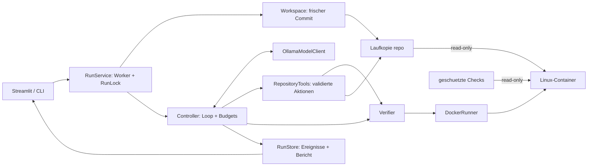

# Architektur und Grenzen

Der Lauf hat nur einen Modus. UI und CLI übergeben einen eigenen Prompt; das Modell
sucht den Code selbst. Verbindliche Rechte und Testbefehle liegen außerhalb der Laufkopie.
Die detaillierte Datei-/Klassenübersicht steht im [Lernleitfaden](learning-guide.md).



```mermaid
sequenceDiagram
    participant U as Benutzer
    participant C as Controller
    participant M as Ollama
    participant T as Werkzeuge
    participant V as Verifier / Docker
    U->>C: Eigener Prompt; neue Commitkopie
    C->>V: Alle Checks als Baseline
    V-->>C: Status, Ausgabe, Exit-Codes
    loop bis finish oder Abbruch/Limit/Fehler
        C->>M: Aufgabe, Rechte, bisherige Beobachtungen
        M-->>C: JSON mit name und arguments
        C->>C: Budget zählen
        C->>T: Argumente und Rechte prüfen, dann ausführen
        T-->>C: Ergebnis oder Fehler
    end
    alt normale Fertigmeldung
        C->>V: Alle Checks unabhängig erneut ausführen
        V-->>C: Endergebnisse
    else Abbruch oder Limit oder Fehler
        C->>C: Fehlende Endchecks als not_run kennzeichnen
    end
    C-->>U: Bericht + geänderte Dateien + Diff
```

## Modellprotokoll

Ein JSON-Objekt pro Runde: `{"name": "...", "arguments": {...}}`.
Ollama bekommt ein aus der Werkzeugregistry abgeleitetes Schema. Der Controller
speichert die Aktion als Assistant-Nachricht und das begrenzte Ergebnis als benannte
User-Beobachtung. Es handelt sich um strukturierte JSON-Ausgaben, nicht um native
Ollama-Toolcall-Nachrichten. Anwendungscode prüft alle Rechte erneut.

Das Modell erhält keinen vorbereiteten Dateiausschnitt und keine Reparaturvorgabe.
Die Beobachtungen stammen nur aus seinen eigenen Werkzeuganfragen. Ein HTTP-Aufruf
ist abbrechbar und zeit-/größenbegrenzt. `ScriptedModelClient` wird ausschließlich in
Tests verwendet. Es gibt keine Laufzeit-Alternative, die einen festen Patch einspielt.

## Datei- und Ausführungsgrenze

- Nur eine frische Kopie des fixierten Git-Commits ist editierbar. Die sechs freigegebenen
  Dateien stehen in `config/target.json`; Tests und Harness-Konfiguration bleiben geschützt.
- Aufgelöste Pfade müssen im Repository liegen. Absolute Pfade, Traversal, Symlinks,
  Windows-Junctions, Hardlinks, ADS und geschützte Namen werden zurückgewiesen.
- `replace_text` ersetzt genau eine eindeutige Stelle atomar. Kein freies `eval`, keine
  Agentenshell, keine Werkzeuge für Push, Merge, Installation oder Deployment.
- Zielcode läuft ausschließlich in Linux-Docker-Containern. `/repo` und `/trusted`
  sind read-only; nur `/tmp` ist beschreibbar (64 MiB tmpfs).
- Nicht-root UID 10001, read-only Rootdateisystem, kein Netzwerk/Docker-Socket,
  keine Credentials/Hostumgebung, keine Capabilities, `no-new-privileges`.
- 64 Prozesse, 512 MiB RAM ohne zusätzlichen Swap, eine CPU. Docker-Logging ist
  ausgeschaltet; der Harness liest Ausgaben begrenzt und entleert die Pipes weiter.
- Ein gemeinsamer Lock verhindert Edits während Checks einschließlich Cleanup.
- Nach jedem Check den eigenen Container stoppen/entfernen und Abwesenheit prüfen.
  Unbestätigtes Ende blockiert weitere Aktionen und neue Läufe (`active-container.json`).

## Prüfergebnisse

Alle Läufe verwenden `acceptance`, `regression_core`, `regression_pricing` vor und
nach der Änderung. Fachlich rote Baselinechecks sind erlaubt und bleiben sichtbar.
Nicht verfügbare Checks oder Baseline-Timeouts blockieren die Modellphase.
`finish` fordert die Endprüfung an. Nur `passed` mit Exit-Code 0, ohne Timeout/Abbruch
und mit bestätigtem Cleanup für **alle** Checks führt zum Zustand `passed`.

`success` im Bericht heißt „alle konfigurierten Endchecks bestanden“. Es ist kein
allgemeines Urteil über die vollständige Erfüllung eines beliebigen Nutzerprompts.
`baseline_bug_reproduced` beschreibt separat den vorbereiteten Belegdruck-Nachweis.
Die Akzeptanz und die Regressionen bleiben für den Agenten schreibgeschützt.

## Standardbudgets

| Grenze | Standard | Bedeutung |
|---|---:|---|
| Aktionen | 40 | Toolversuche einschließlich Ablehnungen, zusätzlich Modellwiederholungen |
| Runden | 50 | Höchstens so viele Modellfortsetzungen |
| Wiederholungen | 2 je Anfrage | Danach model_error; jede Wiederholung kostet Aktionsbudget |
| Check | 120 s | Danach Container beenden; begrenztes Cleanup kommt zeitlich hinzu |
| Modellanfrage | 180 s | Gesamtdauer einer HTTP-Anfrage, pro Wiederholung erneut |
| stdout + stderr / Werkzeugbeobachtung | 64 KiB | Schon beim Einlesen begrenzt, Kürzung sichtbar |
| Datei / Modellantwort | jeweils 256 KiB | Größere Eingaben zurückweisen |
| Gesprächskontext | 192 KiB | Sicherer Stopp; Toolbeschreibungen kommen als fester Zusatz hinzu |
| Artefakte | 8 MiB je Lauf | Hälfte Ereignisse, Viertel Bericht, Viertel Diff |
| Auflisten / Suchen / Lesen | 200 Dateien / 50 Treffer / 400 Zeilen | Zusätzliche Werkzeuggrenzen |
| Git-Archiv | 20 MiB komprimiert / 40 MiB entpackt | Begrenzt Repositoryimport |

Die Quellkopien zählen separat. Es gibt kein globales Limit für die Anzahl archivierter
Läufe; abgeschlossene `.harness/runs/`-Ordner können nach Sicherung entfernt werden.
`config.local.toml` und Umgebungsvariablen konfigurieren den Harness, niemals der Agent.

## Grenzen des POC

Ein lokaler Benutzer, ein aktiver Lauf, festes kleines Repository, keine Dateierstellung
oder -löschung. Ein Container teilt den Kernel des Docker-Hosts; kein VM-Schutzversprechen.
Testdateien sind geschützt, Zielcode und Tests teilen aber einen Python-Prozess im
Container. Gegen absichtliches Manipulieren des Testinterpreters ist dies kein
unabhängiger Beweis. Deshalb bleibt die Prüfung des Diffs erforderlich.

Identischer Commit, Image-ID, Checkhashes und Scripted-Tests machen den Harness
reproduzierbar. Echte LLM-Antworten und deren Erfolg sind auch bei Temperatur 0 nicht
garantiert reproduzierbar. Das wird getrennt protokolliert.
