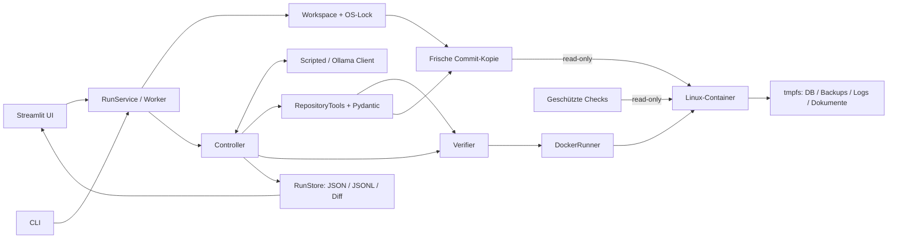

# Architektur



```mermaid
sequenceDiagram
    participant U as UI / CLI
    participant C as Controller-Worker
    participant M as Modell
    participant T as Tools
    participant D as Docker / Verifier
    U->>C: Aufgabe und Provider; OS-Lock
    C->>C: Fixierten Commit frisch exportieren
    C->>D: Baseline: Akzeptanz + zwei Regressionen
    D-->>C: Positivkontrolle und fachlicher Fehlschlag
    loop bis finish, Abbruch oder Budgetende
        C->>M: Aufgabe, begrenzter Kontext, Beobachtungen
        M-->>C: Strukturierte Werkzeuganfrage
        C->>C: Budget zählen, Namen/Argumente validieren
        C->>T: Erlaubte Aktion seriell ausführen
        T-->>C: Ergebnis oder strukturierter Fehler
        C-->>U: Ereignisse und Fortschritt
    end
    C->>D: Unabhängige Endprüfung nach finish
    D-->>C: Status, Exit-Code, Ausgabe, bestätigtes Cleanup
    C-->>U: Objektiver Gesamtstatus, Diff und Bericht
```

## Zuständigkeiten

`config.py` validiert TOML, Umgebungsvariablen und die versionierte Target-Datei.
`workspace.py` liest den echten Git-Commit über `git archive`, ignoriert unversionierte
Referenzdateien und lehnt unsichere Archivpfade/Symlinks ab. Die Referenz wird nie durch
Agententools verändert. Für den Windows-Sandboxbenutzer wird `safe.directory` nur je
Git-Befehl für die bekannte Kopie gesetzt.

`repository.py` bietet sechs feste Werkzeuge: Auflisten, Lesen, Suchen, eindeutiges
Textersetzen, feste Check-ID und Fertigmeldung. Pfade werden sowohl syntaktisch als auch
nach tatsächlicher Auflösung geprüft; Symlinks, Junctions, Hardlinks, ADS, absolute Pfade,
Traversal und geschützte Namen sind gesperrt. Nur bestehende `operations.py`/`app.py`
dürfen geändert werden. Dateierstellung und Löschung sind für diese Task nicht freigegeben;
der Diff-Generator kann beide dennoch darstellen. Ein gemeinsamer Lock serialisiert
Dateiaktionen und vollständige Checks einschließlich Cleanup.

`models.py` enthält ein Protokoll, deterministische Antworten und einen HTTPX-Client für
Ollama. Der native Modus erhält Assistant-Nachrichten, Aufrufindex/ID und zugehörige
Tool-Antworten. Im ausdrücklich konfigurierten JSON-Schema-Modus erzeugt Ollama ein
Objekt `name`/`arguments`; die gleichen Registry-Prüfungen gelten. Der Client bewahrt das
originale Antwort-JSON und normalisiert den Aufruf für den Controller. Auf der Providerseite
werden Beobachtungen als benannte User-Nachrichten serialisiert; die internen Ereignisse
behalten ihre Werkzeugzuordnung. Es gibt keine Interpretation beliebiger Prosa als Code.
Abbruch cancelt die asynchrone HTTP-Anfrage und schließt den Client; verspätete Antworten
dürfen keine Aktionen auslösen. Ein eventuell serverseitig noch auslaufender Ollama-Job
hat keine Repository-Werkzeuge und kann nichts ändern.

`verifier.py` verlangt für die Baseline eine erfolgreiche authentifizierte Positivkontrolle,
genau die erwarteten Mengenverstöße und erfolgreiche Regressionen. `finish` führt immer
erneut alle Pflichtprüfungen aus. `passed`, `failed`, `unavailable`, `not_run` bleiben getrennt.
Modellbehauptungen ersetzen keine Prüfung. Abbruch/Limit führt zu keiner Endprüfung.

`service.py` betreibt genau einen Worker ohne Streamlit-Aufrufe. `st.fragment(run_every=0.5)`
liest thread-sichere Ereignissnapshots und hält den Abbruchknopf bedienbar. `st.cache_resource`
und ein OS-Lock verhindern Doppelstarts über Reruns, Tabs und CLI-Prozesse. Bei unbestätigtem
Containerende verhindert die verbliebene Registry-Datei einen weiteren Lauf.

## Docker-Ausführungsgrenze

- Nur zwei Hostmounts: frische Quellkopie `/repo` und geschützte Prüffiles `/trusted`, beide lesbar.
  Kein gesamtes Harness, Benutzerverzeichnis, Docker-Socket oder Credentialmount.
- Keine Host-Umgebungsvariablen durchgereicht; nur synthetischer DB-Pfad und Python-Einstellungen.
- Nicht-root `10001:10001`, `--read-only`, `--network none`, alle Capabilities entfernt,
  `no-new-privileges`, 64 Prozesse, 512 MiB Speicher ohne zusätzlichen Swap, eine CPU.
- Je maximal 64 MiB tmpfs für `/tmp`, `/repo/data`, `/repo/backups`, `/repo/logs`,
  `/repo/documents`, mit `noexec,nosuid,nodev`. Mountpunkte existieren bereits beim Start.
- Abhängigkeiten nur im vorbereitenden Image-Build. Basisimage per Registry-Digest fixiert;
  jedes Experiment hält zusätzlich die tatsächliche Image-ID fest.
- Docker-Logtreiber `none`; Ausgabe wird während des Einlesens begrenzt und weiterhin
  entleert. Ein zeilenloser Datenstrom kann weder Host-RAM noch Docker-Logs unbegrenzt füllen.
- Nach jedem Check: eigenen Container stoppen, nötigenfalls `rm --force`, Abwesenheit über
  erfolgreiche Docker-Abfrage bestätigen. Nur den CLI-Prozess zu töten gilt nicht als Cleanup.
  Nach unbestätigtem Ende sind weitere Aktionen blockiert; Containername bleibt im Bericht.

Die Grenze setzt einen vertrauenswürdigen lokalen Docker-Daemon und Controller voraus.
Container teilen dessen Kernel; dies ist keine VM-Garantie gegen Kernel-Sicherheitslücken.
Tests und importierter Anwendungscode teilen im Container einen Python-Prozess: geschützt
sind die Prüffiles und der Host, nicht ein manipulationssicherer Test-Interpreter gegen
gezielt bösartigen Python-Code. Deshalb bleibt der erzeugte Diff prüfpflichtig. Der POC
ist für einen lokalen Benutzer und ein kleines Repository ausgelegt.

## Grenzen und Speicherbudgets

| Grenze | Standard | Wirkung |
|---|---:|---|
| Werkzeugversuche | 40 | Auch abgelehnte Anfragen zählen; mehrere Aufrufe einzeln |
| Modellrunden | 50 | Auch Prosa/Antworten ohne Werkzeug zählen |
| Wiederholungen | 2 pro Anfrage | Jede Wiederholung verbraucht zusätzlich eine Aktion |
| Check | 120 s | Containerende inklusive Kindprozessen wird erzwungen |
| Modellanfrage | 180 s | Gesamtdauer, nicht nur Socket-Inaktivität |
| Werkzeug-/Check-Ausgabe | 64 KiB | stdout + stderr gemeinsam, Kürzung sichtbar |
| Einzeldatei | 256 KiB | Größere Dateien abgewiesen; maximal 400 Zeilen pro Lesen |
| Modellantwort | 256 KiB | Bereits beim HTTP-Einlesen begrenzt |
| Modellkontext | 192 KiB | Sicherer Stopp statt Verlust von Tool-Zuordnungen |
| Laufartefakte | 8 MiB | 1/2 Ereignisse, 1/4 Bericht, 1/4 Diff; Kürzungen gekennzeichnet |
| Auflisten / Suche | 200 / 50 | Ergebnisanzahl begrenzt; maximal 5000 Dateieinträge durchsucht |
| Git-Archiv | 20 MiB / 40 MiB | Komprimiert / entpackt; kein unbegrenzter Repository-Import |

Quellkopien zählen separat zum Repositorylimit. Das Artefaktbudget gilt pro Lauf, nicht für
beliebig viele archivierte Läufe; alte abgeschlossene Laufverzeichnisse entfernt der Nutzer
nach Sicherung gewünschter Berichte. Status, Exit-Codes und Gründe bleiben trotz Textkürzung erhalten.

## Offizielle API-Grundlagen

Geprüft am 2026-10-05: [Ollama Tool Calling](https://docs.ollama.com/capabilities/tool-calling),
[Ollama Structured Outputs](https://docs.ollama.com/capabilities/structured-outputs),
[Chat API](https://docs.ollama.com/api/chat),
[Streamlit Fragments](https://docs.streamlit.io/develop/api-reference/execution-flow/st.fragment),
[Streamlit AppTest](https://docs.streamlit.io/develop/api-reference/app-testing/st.testing.v1.apptest),
[Docker Run](https://docs.docker.com/engine/containers/run/).
